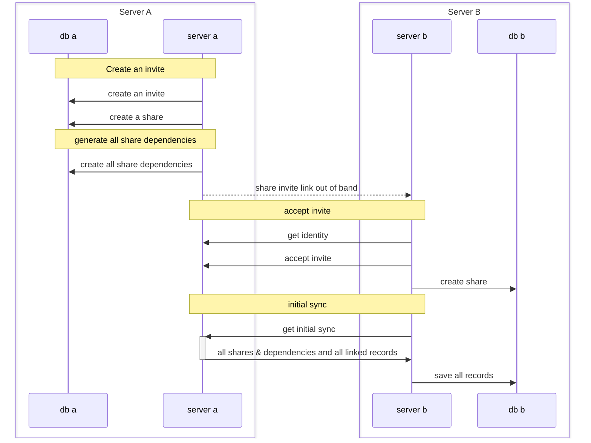
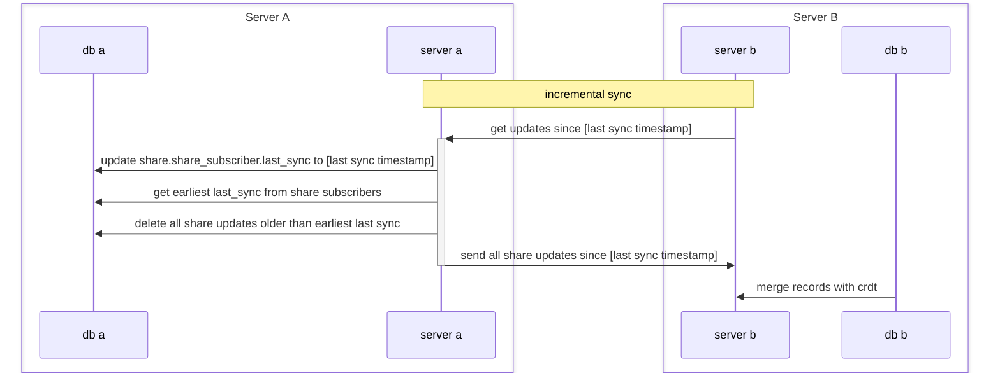

Initial sync

```mermaid
sequenceDiagram
    box Server A
    participant db a
    participant server a

    end

    box Server B
    participant server b
    participant db b
    end

    # create an invite
    Note over db a,server a: Create an invite
    server a ->> db a: create an invite
    server a ->> db a: create a share
    note over server a,db a: generate all share dependencies
    server a ->> db a: create all share dependencies


    server a -->> server b: share invite link out of band

    # accept an invite
    note over server a,server b: accept invite
    server b ->> server a: get identity
    server b ->> server a: accept invite
    server b ->> db b: create share

    # initial sync
    note over server a, server b: initial sync
    server b ->>+server a: get initial sync
    server a ->>-server b: all shares & dependencies and all linked records
    server b ->>db b: save all records
```

Incremental Sync

```mermaid

sequenceDiagram
    box Server A
    participant db a
    participant server a

    end

    box Server B
    participant server b
    participant db b
    end

    # incremental sync
    note over server a,server b: incremental sync

    server b ->>+server a: get updates since [last sync timestamp]
    server a ->>db a: update share.share_subscriber.last_sync to [last sync timestamp]
    server a ->>db a: get earliest last_sync from share subscribers
    server a ->>db a: delete all share updates older than earliest last sync
    server a ->>-server b: send all share updates since [last sync timestamp]
    db b ->>server b: merge records with crdt


```
